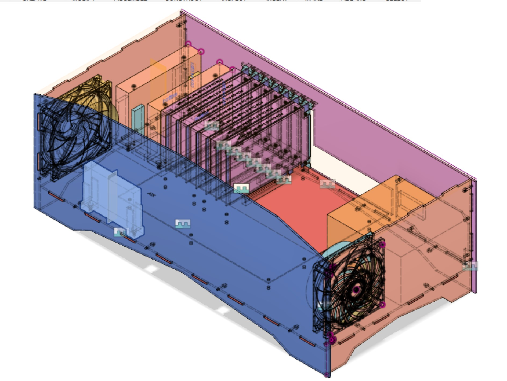
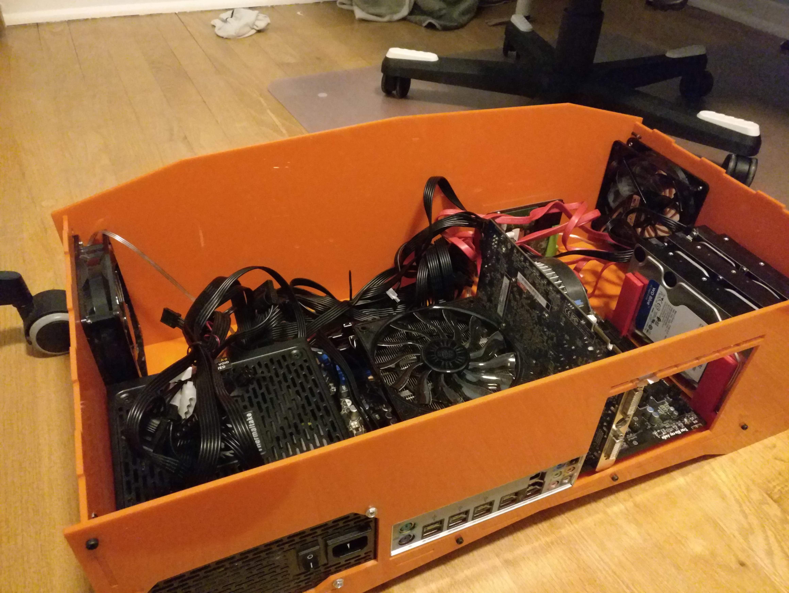

# L.A.C.C

## Laser-cut ATX Computer Case

This is a full sized ATX computer case you can laser cut (and probably cut using a CNC but I don't have one of those)

It should fit any ATX compliant motherboard, but I've only tried the one motherboard I have.

It has space for 3x 3.5" hard drives and a 2.5" hard drive, which are held by seperate 3d printed modules.

The entire design was done in Fusion 360. You can view it / download it [here](https://a360.co/2EToDJn) or use the 

[more photos](https://photos.app.goo.gl/nMJByEWeSShFq6Pd6)

## Materials

### Case 
 - 5x sheets of 24" x 12" sheet of 1/8" or 3mm acrylic or MDF 
 - 26x M3 nuts
 - 20x M3x16 screws (for holding case together)
 - 6x M3x12 standoffs (for motherboard)
 - 6x M3x4 screws (for standoffs)
 - 2x 120mm Computer Fan
 - 4x 6-32 screws for ATX power supply

### Hard Drive Bays
 - 2x of the 3.5" drive holder parts
 - 2x of the 2.5" drive holder parts
 - 6x M3x10 screws
 - 6x M3 nuts

## Models Used

 - [Accurate Blank Motherboard & PCIe Card Models](https://smallformfactor.net/forum/resources/accurate-blank-motherboard-pcie-card-models.25/) by subtec
 - [120mm PC Case Fan](https://grabcad.com/library/120mm-pc-case-fan-1) by 
Ollie Keattch
 - Power supply (mine)
 - Hard Drive 2.5" and 3.5" (mine)

## License

 [Creative Commons Attribution-ShareAlike 4.0 International](https://creativecommons.org/licenses/by-sa/4.0/)

 You are free to use, sell and remix freely as long as any modifications you make are also shared under this same license